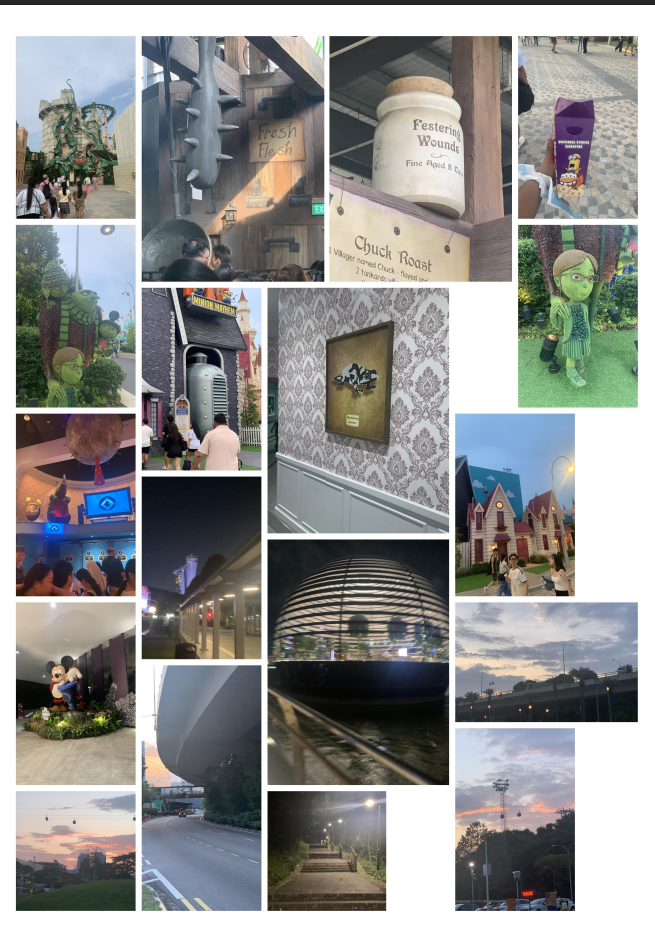

# photo-mosaic-pdf

Turn a folder of photos into a printable A4 mosaic PDF. Photos get mixed tile sizes (small squares, tall and wide rectangles, big squares) instead of a fixed grid, so the page looks like a collage. Made for journals, scrapbooks and planners.



## Features

- Mixed tile sizes, chosen from each photo's orientation (portrait, landscape, square)
- Multi-page A4 PDF at 300 DPI
- Reads JPG, PNG, WebP and HEIC (phone photos)
- Searches subfolders
- Small gaps between photos so they're easy to cut out
- Reshuffle the layout any time with `--seed`

## Install

You need Python 3.8 or newer.

```
py -m pip install -r requirements.txt
```

On macOS/Linux, use `python3 -m pip install -r requirements.txt`.

## Usage

```
py photo_mosaic.py photos -o mosaic.pdf
```

Here `photos` is the folder containing your images.

### Options

| Option | Default | What it does |
|---|---|---|
| `folder` | (required) | Folder with your photos |
| `-o`, `--output` | `mosaic.pdf` | Output PDF file |
| `--cols` | 10 | Grid columns per page |
| `--rows` | 14 | Grid rows per page |
| `--cell` | 20 | Cell size in mm. Smaller = smaller photos |
| `--gap` | 2 | Gap between photos in mm |
| `--dpi` | 300 | Output resolution |
| `--seed` | 1 | Change for a different layout |

### Example: bigger photos

```
py photo_mosaic.py photos -o big.pdf --cols 8 --rows 11 --cell 24
```

## Printing

Print at **Actual size / 100%** (not "Fit to page") on A4 paper, then cut along the gaps. Every photo is at least 2 x 2 cells, so with the default settings the smallest is about 38 x 38 mm.

## Notes

- Photos are cropped to fit their tile, so faces near the edges may be trimmed.
- Files that can't be read as images are skipped and listed at the end.

## License

Apache License 2.0. See [LICENSE](LICENSE).
